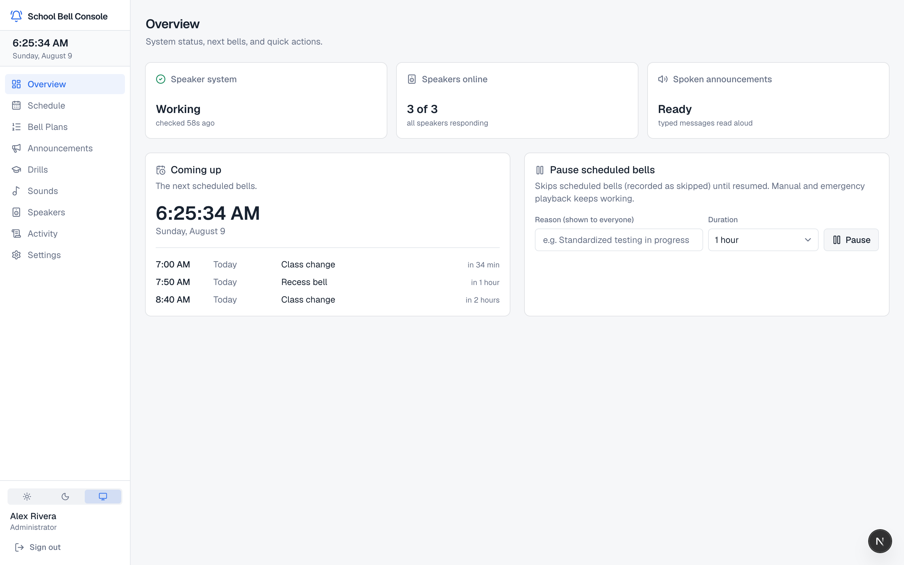
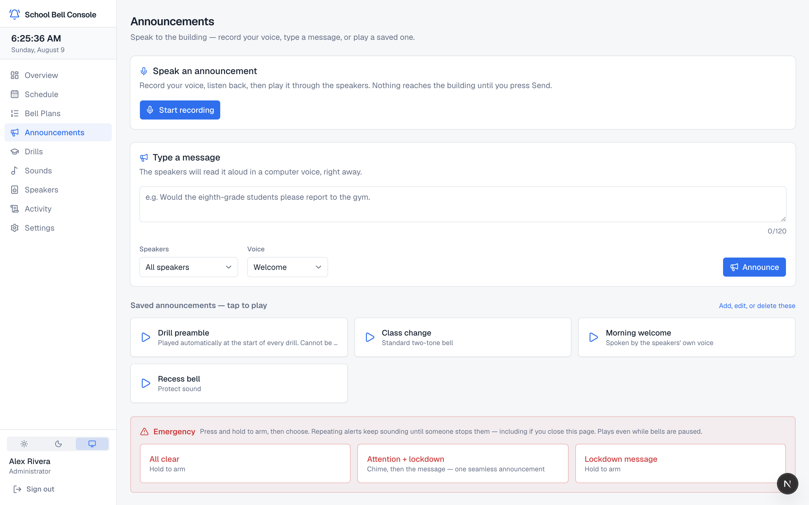
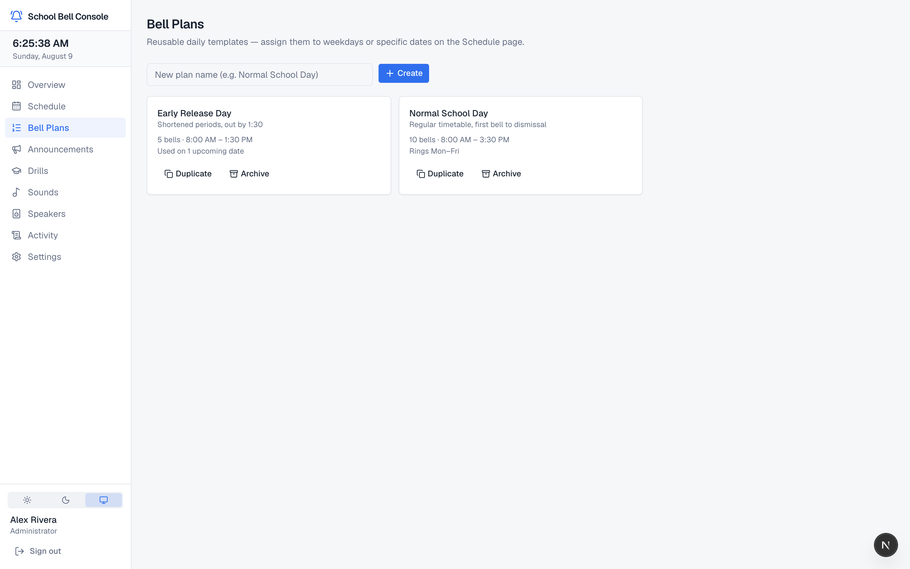
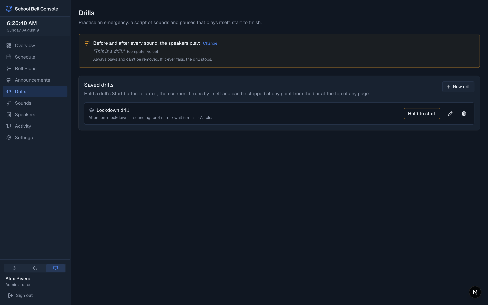

# UniFi Bell Console

**School bell scheduling and PA announcements for UniFi Protect AI Speakers.**

UniFi Protect has no time-based trigger, so schools (and churches, offices,
warehouses…) with AI Speakers cannot schedule bells or announcements. This
project fills that gap with a local-first application: everything runs on one
always-on machine on your LAN, so bells keep ringing when the internet doesn't.

- **Scheduled bells** through Protect's official Integration API (Alarm Manager
  webhooks) — the only path with a real delivery result, ~30ms on LAN.
- **Typed announcements** spoken by the speaker's TTS voice.
- **Uploaded audio and browser-recorded announcements**, streamed over
  Protect's talkback WebSocket — including **combined announcements** (an
  attention chime spliced seamlessly into a spoken message).
- **Repeating emergency alerts** (lockdown, shelter, all-clear) that stream
  continuously and stop within ~0.3s of the Stop button.
- **Drill sequences** — scripted practice runs, always bracketed by a
  "this is a drill" announcement, aborted instantly by a real alert.
- Speaker zones, pause, DST-safe scheduling, health monitoring, full audit
  trail, plain-language UI for school staff.
- **Today command center** with the live day timeline, next-bell countdown,
  staff-readable readiness, and guarded skip/delay/plan-change controls.

## What it looks like

**Overview** — today's bell plan with day-of controls (skip, delay, switch plan), system health, and pause:



**Announcements** — record your voice, type a message, or tap a saved one;
emergency tiles are hold-to-arm:



**Bell plans** — reusable day templates, with each plan's shape and usage:



**Drills** (dark theme) — scripted practice runs, always bracketed by a
"this is a drill" announcement:



## Try it without hardware

```
cd console && npm install && npm run demo
```

Then open http://localhost:3001 and sign in as **demo / demo1234**
(or **staff / demo1234** for the staff view). This seeds a fictional school
into `data/demo.db` and serves the full interface — UI only: nothing plays
without a real NVR, and the scheduler worker is not started.

## Layout

- **[console/](console/)** — the application: Next.js staff UI + scheduler
  worker + SQLite, two supervised processes on one box. Setup, operating
  notes, and the priority model are in its README.
- **[phase0/](phase0/)** — the hardware/API validation harness, and
  **[TALKBACK-EXPERIMENT.md](phase0/TALKBACK-EXPERIMENT.md)**: to our
  knowledge the only documented working recipe for streaming arbitrary audio
  to the UP-AI-Speaker, with the timing constants measured on hardware
  (encoding, arm delay, frame pacing, session-release floor, long-session
  behaviour). If you build anything on Protect's talkback channel, start there.
- **[deploy/](deploy/)** — launchd (macOS) and systemd (Linux) supervision
  configs, and **[RUNBOOK.md](deploy/RUNBOOK.md)**: bare machine to ringing
  bells, in order — BIOS settings, host setup, install, and the verification
  steps that actually prove it works (including pulling the plug).

## Honest caveats

- **This is not a life-safety system.** Fire detection and evacuation
  signalling belong to certified, supervised equipment. Use the emergency
  features for lockdown/shelter/all-clear announcements, not as a fire alarm.
- Parts of the integration use **undocumented Protect APIs** (TTS, talkback).
  They are version-watched — the console flags them for re-validation when
  Protect updates — but a Protect release can break them without notice.
- Talkback is **write-only**: a success means "transmitted", never "played".
  The README documents which delivery methods have real confirmation.

Verified against UniFi Protect 7.1.x and UP-AI-Speaker firmware 1.0.6.

## License

[MIT](LICENSE). Not affiliated with, endorsed by, or supported by Ubiquiti
Inc. "UniFi" and "UniFi Protect" are trademarks of Ubiquiti Inc., used here
to describe compatibility.
